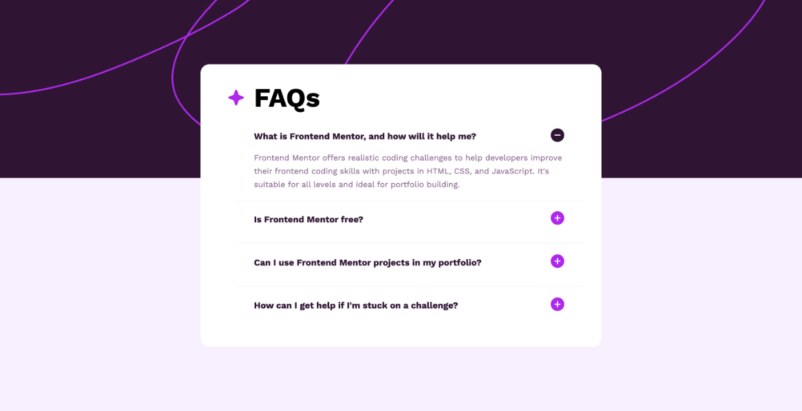

# ❓ Frontend Mentor - FAQs Accordion Solution (using only HTML and CSS)

This is a solution to the <a href="https://www.frontendmentor.io/challenges/faq-accordion-wyfFdeBwBz" target="_blank">[FAQs Accordion Challenge on Frontend Mentor]</a>.

# 📸 Screenshot

<table>
  <thead>
    <th>Web Version</th>
    <th>Active State</th>
    <th>Mobile Version</th>
  </thead>
  <tbody>
    <tr>
      <td></td>
      <td></td>
      <td></td>
    </tr>
  </tbody>
</table>

# 🔗 Links

<ul>
  <li><strong>Solution URL:</strong> github.com/itsadnwn/faqs-accordion-htmlcss</li>
  <li><strong>Live Site URL:</strong> itsadnwn-faqs-accordion-htmlcss.vercel.app/</li>
</ul>

# 📂 Technologies

This project was built with:

<ul>
  <li><strong>HTML:</strong> Markup language for creating the content and structure, with unordered lists (ul) used to organize the accordion items semantically.</li>
  <li><strong>CSS:</strong> For styling both web and mobile versions, implementing smooth animations for accordion expand/collapse transitions, and creating responsive layouts.</li>
</ul>

# 🖱️ Interaction

<ul>
  <li>Click on any question to expand and reveal its answer with a smooth transition animation.</li>
  <li>Visual feedback provided through dynamic icon change to indicate expanded/collapsed states.</li>
  <li>Fully responsive interaction experience across both desktop and mobile devices.</li>
</ul>

# 🗒️ Key Learning Points

  <h4>Responsive Background Images</h4>
  
<strong>Desktop vs Mobile:</strong> Implement different background images for desktop and mobile viewports using CSS media queries to ensure optimal display across devices.

  <h3>Positioning Techniques</h3>
  
<strong>Layering elements:</strong> Using <code>position: absolute</code> on the parent container and <code>position: relative</code> on the accordion box to position it above the background image.

  <h3>Dynamic Icon Management</h3>
  
<strong>Default state:</strong> Add image icons at the end of the accordion labels using CSS pseudo-elements (<code>:before</code> and <code>:after</code>).

  
<strong>Active state:</strong> Implement icon changes for opened accordion questions using CSS classes.

  <h3>Content Overflow Management</h3>
  
<strong>Padding considerations:</strong> Remove padding from accordion content contains to ensure texts can be completely hidden when collapsed.

  <h3>CSS Functions for Precise Control</h3>
  
<strong><code>calc() function:</strong></code> Use when you need precise calculations mixing different units:

  <ul>
    <li>Example: <code>calc(100vw - 2rem)</code> calculates full viewport width minus 2rem spacing</li>
    <li>Perfect for creating layouts that account for fixed margins or padding</li>
  </ul>

  
<strong><code>clamp() function:</strong></code> Use for smooth responsive scaling with defined limits:

  <ul>
    <li>Syntax: <code>clamp(minimum, preferred, maximum)</code></li>
    <li>Example: <code>clamp(0.875em, 2vw, 1rem)</code> ensures font size scales between 0.875em and 1rem based on viewport width</li>
    <li>Provides better responsive typography without media queries</li>
  </ul>

